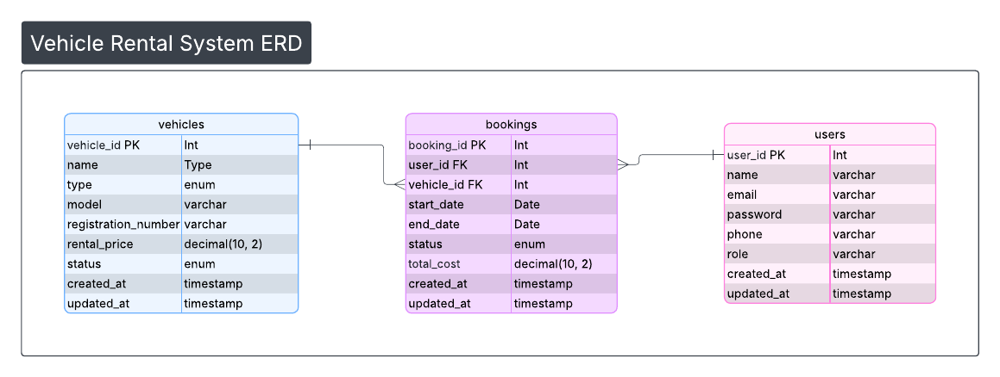

# Vehicle Rental System Database Assignment

## ERD Diagram
[View ERD Diagram](https://lucid.app/lucidchart/12d7f48b-aa04-4ed5-b64d-5292a7edb16f/edit?viewport_loc=-818%2C-981%2C2623%2C1333%2C0_0&invitationId=inv_663ebca1-7a0b-491f-b4d9-874a43317fc8)



## Database Tables
- Users
- Vehicles
- Bookings

## SQL Queries
1. INNER JOIN – Booking with customer and vehicle name
2. NOT EXISTS – Vehicles never booked
3. WHERE – Available vehicles by type
4. GROUP BY & HAVING – Vehicles with more than 2 bookings


## Database
PostgreSQL


# SQL Queries & Expected Output

## Query 1: Retrieve Booking Information (INNER JOIN)

Retrieve booking information along with customer name and vehicle name.

```sql
SELECT 
    booking_id,
    u.name AS customer_name,
    v.name AS vehicle_name,
    start_date,
    end_date,
    availability_status AS status
FROM bookings AS b
INNER JOIN users AS u 
ON u.user_id = b.user_id
INNER JOIN vehicles AS v 
ON v.vehicle_id = b.vehicle_id;
```

### Expected Output

## Query 1 Result: Booking Information with Customer and Vehicle Name

| booking_id | customer_name | vehicle_name        | start_date | end_date  | status    |
| ---------- | ------------- | ------------------- | ---------- | --------- | --------- |
| 1          | John Doe      | Toyota Camry        | 7/1/2024   | 7/5/2024  | confirmed |
| 2          | Sarah Johnson | Honda Civic         | 7/10/2024  | 7/12/2024 | pending   |
| 3          | Michael Smith | Ford F-150          | 7/15/2024  | 7/20/2024 | completed |
| 4          | Emily Davis   | Yamaha YZF-R3       | 7/18/2024  | 7/22/2024 | cancelled |
| 5          | John Doe      | Chevrolet Silverado | 7/25/2024  | 7/30/2024 | confirmed |
| 6          | John Doe      | Chevrolet Silverado | 7/1/2024   | 7/5/2024  | confirmed |
| 7          | John Doe      | Chevrolet Silverado | 7/10/2024  | 7/12/2024 | pending   |
| 8          | John Doe      | Chevrolet Silverado | 7/25/2024  | 7/30/2024 | confirmed |
---

# Query 2: Vehicles Never Booked (NOT EXISTS)

Find all vehicles that have never been booked.

```sql
SELECT 
    vehicle_id,
    name,
    type,
    model,
    registration_number,
    rental_price,
    availability_status AS status
FROM vehicles AS v
WHERE NOT EXISTS (
    SELECT *
    FROM bookings AS b
    WHERE b.vehicle_id = v.vehicle_id
);
```

### Expected Output

| vehicle_id | name               | type  | model | registration_number | rental_price | status      |
| ---------- | ------------------ | ----- | ----- | ------------------- | ------------ | ----------- |
| 11         | Suzuki Gixxer      | bike  | 2022  | DHA-3456            | 28           | maintenance |
| 17         | Tesla Model 3      | car   | 2024  | DHA-9900            | 150          | available   |
| 12         | Ford Ranger        | truck | 2020  | DHA-7890            | 120          | available   |
| 10         | Yamaha R15         | bike  | 2023  | DHA-9012            | 30           | available   |
| 15         | Kawasaki Ninja 400 | bike  | 2023  | DHA-5566            | 45           | available   |
| 13         | Toyota Hilux       | truck | 2021  | DHA-1122            | 130          | rented      |
| 8          | Toyota Corolla     | car   | 2022  | DHA-1234            | 60           | available   |
| 16         | Isuzu N-Series     | truck | 2019  | DHA-7788            | 110          | maintenance |
| 14         | Hyundai Tucson     | car   | 2023  | DHA-3344            | 85           | available   |
| 9          | Honda Civic        | car   | 2021  | DHA-5678            | 75           | rented      |


---

# Query 3: Available Vehicles of Type Car

Retrieve all available vehicles of type car.

```sql
SELECT 
    vehicle_id,
    name,
    type,
    model,
    registration_number,
    rental_price,
    availability_status AS status
FROM vehicles
WHERE type = 'car'
AND availability_status = 'available';
```

### Expected Output

| vehicle_id | name           | type | model | registration_number | rental_price | status    |
| ---------- | -------------- | ---- | ----- | ------------------- | ------------ | --------- |
| 1          | Toyota Camry   | car  | 2020  | ABC123              | 50           | available |
| 2          | Honda Civic    | car  | 2019  | XYZ789              | 45           | available |
| 8          | Toyota Corolla | car  | 2022  | DHA-1234            | 60           | available |
| 14         | Hyundai Tucson | car  | 2023  | DHA-3344            | 85           | available |
| 17         | Tesla Model 3  | car  | 2024  | DHA-9900            | 150          | available |


---

# Query 4: Vehicles with More Than 2 Bookings

Find vehicles that have more than 2 bookings.

```sql
SELECT 
    name AS vehicle_name,
    COUNT(*) AS total_bookings
FROM vehicles
JOIN bookings 
ON vehicles.vehicle_id = bookings.vehicle_id
GROUP BY name
HAVING COUNT(*) > 2;
```

### Expected Output

| vehicle_name        | total_bookings |
| ------------------- | -------------- |
| Chevrolet Silverado | 4              |


## viva Videos

| Video | Questions | Link |
|------|-------------|------|
| 1 | What is a foreign key and why is it important in relational databases? | https://www.loom.com/share/72679d3bff0c407a97c9a5129887f5e1|
| 2 | What is the difference between WHERE and HAVING clauses in SQL? | https://www.loom.com/share/cd8ed27e148144c18e4ad4712d32dc73 |
| 3 | What is a primary key and what are its characteristics? | https://www.loom.com/share/e8f139237cdd4059961b3cf5bf45531b |
| 4 | What is the difference between INNER JOIN and LEFT JOIN in SQL?| https://www.loom.com/share/33b656b454ba46958e09169a9fa7430d |


